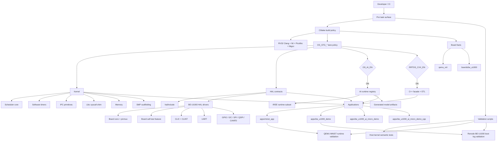

# rrtos

[](https://deepwiki.com/mingshi2333/rrtos)

`rrtos` is a bare-metal RISC-V RTOS repository. Its supported surface is
RTOS-first: the project is organized around explicit firmware lanes, and AI is
an optional runtime extension on top of those lanes rather than the repository's
primary identity.

The current supported firmware lanes are:

- `rv32` on `qemu_virt`, with the canonical MNIST AI validation app.
- `be-u1000` on BE-U1000 / EVU-BA-2.3-shaped hardware, with board self-test
  validation in Renode.

Supported lane markers used by the validation contract:

- `qemu_virt` + `apps/mnist_app` + `ai/include/ai_model_registry.h`
- `be_u1000` + `apps/be_u1000_demo` (current EVU-BA-2.3-shaped board path)

The tree also contains observation lanes and historical experiments. A path is
supported only when it is listed in `docs/SUPPORTED_MATRIX.md` and has a
documented validation gate.
Optional observation lanes do not promote a path to supported status.

## Overall Architecture



## What Lives Where

| Area | Main paths | Role |
| --- | --- | --- |
| Architecture | `arch/riscv/`, `cmake/riscv*_*.cmake` | RISC-V context/trap code, linker defaults, ISA and ABI selection |
| Board facts | `boards/be_u1000/` | BE-U1000 memory map, IRQ numbers, startup code, board linker scripts |
| Kernel | `kernel/`, `memory/`, `multicore/` | Scheduler, timers, IPC, memory helpers, SMP support scaffolding |
| HAL | `hal/include/`, `hal/src/` | Generic HAL interfaces and board-specific driver implementations |
| C++ facade | `cxx/`, `apps/be_u1000_etl_smoke/` | Optional freestanding C++/ETL layer, disabled by default |
| AI runtime | `ai/`, `third_party/iree/` | Registry-backed IREE runtime integration for bare-metal firmware |
| Applications | `apps/` | Firmware entrypoints for supported, observation, and experimental lanes |
| Validation | `scripts/`, `tests/`, `.github/workflows/` | Local gates, boot-log checkers, unit-style tests, CI workflows |
| Docs | `docs/` | Architecture, configuration, testing, support matrix, and board notes |

## Build And Runtime Model

`CMakeLists.txt` is the central build-policy file. Board headers publish
hardware facts, while CMake chooses the active lane policy and exports it
through `OS_CFG_*` compile definitions.

Important CMake options:

| Option | Meaning |
| --- | --- |
| `CONFIG_BOARD` | Selects `qemu_virt` or `be_u1000` |
| `ARCH_BITS` | Supported lanes use RV32 |
| `RISCV_MARCH` / `RISCV_MABI` | Select target ISA and ABI; BE-U1000 uses `rv32imafc_zifencei` + `ilp32f` |
| `OS_AI_EN` | Enables the IREE-backed AI runtime |
| `OS_SMP_EN` | Enables SMP configuration; BE-U1000 runtime support is still staged |
| `OS_IPC_EN` / `OS_TIMER_EN` | Select kernel IPC and software timer modules; default ON |
| `OS_LIBC_SHIM_EN` / `OS_HEAP_EN` | Select picolibc syscall shim and RTOS heap bridge; default ON |
| `RRTOS_CXX_EN` | Enables the optional freestanding C++/ETL layer; default OFF |
| `BE_U1000_APP` | Selects the BE-U1000 app lane |
| `RRTOS_HAL_FEATURES` | `auto` derives a small HAL feature set from the selected app |

The build links freestanding firmware with Picolibc, `lld`, section GC, and
project-owned linker scripts. The RV32 Pixi environments also provide a local
`libgcc.a` compatibility path so helper routines resolve consistently.

## Supported Firmware Lanes

### RV32 QEMU Lane

The canonical RV32 lane is the supported AI validation path:

- board: `qemu_virt`
- app: `apps/mnist_app`
- AI model registry: `ai/include/ai_model_registry.h`
- model declaration: `ai_models.yaml`
- generated model artifacts: `apps/mnist_app/generated/`
- runtime proof: QEMU runs a committed five-sample MNIST batch and checks labels

Run it with:

```bash
pixi run -e rv32 validate-supported-rv32
```

### BE-U1000 Board Lane

The canonical BE-U1000 lane validates board bring-up behavior:

- board: `be_u1000`
- app: `apps/be_u1000_demo`
- IRQ model: CLIC with CLINT timer/IPI support
- board self-test: UART, GPIO, I2C, SPI, QSPI flash, CANFD
- runtime proof: Renode boot log validation via `scripts/be_u1000/check_boot_log.py`

Run it with:

```bash
pixi run -e be-u1000 validate-supported
```

The supported BE-U1000 lane currently builds with `OS_AI_EN=OFF`. Additional
BE-U1000 app lanes are useful for bring-up and regression work, but they remain
observation or experimental lanes until promoted in `docs/SUPPORTED_MATRIX.md`.

## Optional C++/ETL Extension

The RTOS core remains C/ASM. `RRTOS_CXX_EN=ON` adds an optional freestanding C++
facade. ETLCPP is provided by the Pixi-managed `etlcpp` package, pinned to the
official `ETLCPP/etl` release tag `20.41.7`. The first proof lane is
`BE_U1000_APP=etl_smoke`, which exercises a fixed-capacity ETL-backed queue
without enabling exceptions, RTTI, STL containers, or global constructors.

```bash
pixi run -e be-u1000 configure-etl-smoke
pixi run -e be-u1000 build-etl-smoke
```

The C++ layer can also host an app entrypoint over the C AI runtime. The
`BE_U1000_APP=ai_micro_demo_cpp` lane keeps the model registry, IREE runtime,
and generated model objects in C, while the application orchestration is C++ and
calls the narrow `ai/include/ai_model_registry_c_api.h` ABI.

## AI Runtime Extension

The AI runtime is registry-backed. Applications find models by name, query
tensor metadata through the registry API, then call synchronous inference:

```text
ai_models*.yaml
  -> scripts/ai_codegen.py
  -> generated C wrappers and static model objects
  -> rv_aios_models
  -> ai/src/ai_model_registry.c
  -> application calls ai_runtime_init / ai_model_find_by_name / ai_infer_sync
```

The supported AI path is `apps/mnist_app` on the RV32 QEMU lane. The maintained
AI task surface is:

```bash
pixi run -e rv32 validate-supported-ai
pixi run -e rv32 validate-mnist-runtime
pixi run -e rv32 observe-mnist-runtime-renode
pixi run -e rv32 compare-mnist-runtime-platforms
```

`third_party/iree` is pinned as a runtime dependency. The supported build
initializes only the IREE runtime submodules it needs; it does not depend on the
full upstream compiler or GPU dependency graph.

## BE-U1000 AI Micro Demo

`apps/be_u1000_ai_micro_demo` is an explicit BE-U1000 AI bring-up app. It is
useful for checking the static-library IREE path on the board target, but it is
not the blocking supported BE-U1000 lane.

It uses:

- `BE_U1000_APP=ai_micro_demo`
- `BE_U1000_APP=ai_micro_demo_cpp` for the experimental C++ app-layer variant
- `OS_AI_EN=ON`
- `ai_models_be_u1000_ai_micro.yaml`
- `apps/be_u1000_ai_micro_demo/model/hello_world_float.tflite`
- generated static model object code under `apps/be_u1000_ai_micro_demo/generated/`
- binary size guard: `scripts/check_be_u1000_ai_demo_size.py`

The AI micro lanes should use `BE_U1000_MEMORY_MODEL=flash`. The IREE-backed
runtime is larger than the TCM-only text window, while the generated binary
still fits the current 256KB flash guard.

Manual build:

```bash
python3 scripts/ai_codegen.py --config ai_models_be_u1000_ai_micro.yaml
cmake -B build-be_u1000_ai_micro \
  -DCMAKE_TOOLCHAIN_FILE=cmake/riscv32-pixi.cmake \
  -DARCH_BITS=32 \
  -DCONFIG_BOARD=be_u1000 \
  -DBE_U1000_MEMORY_MODEL=flash \
  -DBE_U1000_APP=ai_micro_demo \
  -DOS_AI_EN=ON \
  -DOS_SMP_EN=OFF \
  -DRISCV_MARCH=rv32imafc_zifencei \
  -DRISCV_MABI=ilp32f \
  -DRISCV_ABI=ilp32d \
  -DCMAKE_BUILD_TYPE=MinSizeRel
cmake --build build-be_u1000_ai_micro -j
python3 scripts/check_be_u1000_ai_demo_size.py \
  --binary build-be_u1000_ai_micro/rrtos_be_u1000.bin \
  --max-bytes 262144
```

C++ app-layer build:

```bash
pixi run -e be-u1000 configure-ai-micro-cpp
pixi run -e be-u1000 build-ai-micro-cpp
```

Current flash-size evidence for the same model/runtime configuration:

| Lane | `.text` | `.data` | `.bss` | `.bin` |
| --- | ---: | ---: | ---: | ---: |
| `ai_micro_demo` | 183372 | 3052 | 111616 | 186424 |
| `ai_micro_demo_cpp` | 183436 | 3052 | 111616 | 186488 |

The C++ app layer currently adds 64 bytes over the C app. The dominant size
cost is the IREE runtime and model stack, not the C++ dispatch layer.

## Quick Start

Install the Pixi environments:

```bash
pixi install
pixi install -e be-u1000
```

The default pixi environment targets the supported `rv32` lane.

Initialize the supported IREE runtime subset:

```bash
pixi run init-iree
```

Run the main local gates:

```bash
pixi run validate-kernel-semantics
pixi run -e rv32 validate-supported-rv32
pixi run -e be-u1000 validate-supported
```

For a fuller setup walkthrough, see `docs/GETTING-STARTED.md`.

## Validation Strategy

Blocking gates define supported behavior:

| Gate | Command | What it proves |
| --- | --- | --- |
| Kernel semantics | `pixi run validate-kernel-semantics` | Host-side scheduler, IPC, timer, memory, and harness semantics |
| RV32 supported lane | `pixi run -e rv32 validate-supported-rv32` | Config contracts, build, footprint reports, AI footprint, QEMU MNIST runtime |
| BE-U1000 supported lane | `pixi run -e be-u1000 validate-supported` | Config contracts, ABI cache, build, footprint, IRQ map, Renode boot-log self-test |

Observation lanes are intentionally separate:

```bash
pixi run -e rv32 observe-mnist-runtime-renode
pixi run -e rv32 compare-mnist-runtime-platforms
pixi run -e be-u1000 validate-hal-apps
```

The firmware CI workflow mirrors the two supported firmware lanes in
`.github/workflows/firmware-supported-matrix.yml`.

## Common Workflows

### Regenerate Canonical MNIST Artifacts

```bash
python3 scripts/ai_codegen.py
pixi run -e rv32 validate-supported-ai
pixi run -e rv32 validate-supported-rv32
```

### Work On BE-U1000 HAL Apps

```bash
pixi run -e be-u1000 validate-hal-apps --build-only
pixi run -e be-u1000 validate-hal-apps
pixi run -e be-u1000 validate-supported
```

### Inspect Generated Evidence

Useful local evidence files include:

- `build/apps/mnist_app/mnist_validation_footprint.md`
- `build/apps/mnist_app/mnist_validation_ai_footprint.md`
- `build-be_u1000/rrtos_be_u1000_footprint.md`
- `logs/be_u1000_selftest_runtime.md`
- `logs/be_u1000_hal_matrix.md`

Avoid committing timestamp-only log churn unless refreshing evidence is the
purpose of the change.

## Documentation Map

Start here:

- `docs/README.md` - documentation index and suggested reading order
- `docs/GETTING-STARTED.md` - setup and first validation commands
- `docs/SUPPORTED_MATRIX.md` - supported vs experimental scope
- `docs/ARCHITECTURE.md` - deeper architecture and lane ownership
- `docs/CONFIGURATION.md` - Pixi, CMake, HAL, IREE, and toolchain options
- `docs/TESTING.md` - blocking gates, observation lanes, and CI notes
- `docs/DEVELOPMENT.md` - contribution workflow and promotion rules
- `docs/HAL_CONFIGURATION.md` - BE-U1000 HAL feature selection
- `docs/AI_CANONICAL_PATH.md` - AI model registry and validation contract
- `docs/switching_guide.md` - which target or validator to use for a task

Board-focused references:

- `boards/be_u1000/DFU_FLASHING_GUIDE.md`
- `docs/BE_U1000_MULTICORE_NOTES.md`
- `docs/BE_U1000_RUNTIME_VALIDATION_MATRIX.md`
- `docs/EVU_BA_PINMAP.md`
- `docs/EVU_BA_2_3_BOARD_INVENTORY.md`

Historical reports remain in-tree for archaeology, but they are not the source
of truth for support status. Prefer the docs listed above over older notes that
mention legacy RV64 workflows, `ai_demo`, `mobilenet_test`, or board experiments
outside the declared firmware lanes.
