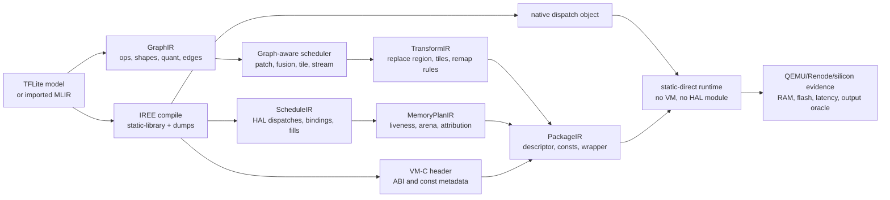

# Graph-Aware Static-Direct TinyML Research Design

Status: research design
Scope: fixed-shape TinyML inference on RRTOS, IREE static-library native
dispatches, no-VM/no-HAL static-direct execution, and graph-aware peak-memory
optimization.

## Thesis

The useful research direction is not "HAL remap beats graph optimization".
HAL-level remap is too low-level: it sees dispatches, bindings, byte offsets,
and constants, but it does not know operator semantics, receptive fields,
padding, strides, residual edges, or quantization rules.

The stronger direction is:

```text
Graph-aware memory scheduling for IREE static-direct TinyML

TFLite / TOSA / Linalg / Flow graph
  -> patch, fusion, tile, or stream schedule search
  -> transformed fixed-shape IREE schedule
  -> generated static-direct descriptor
  -> no-VM/no-HAL MCU runtime
```

In this design, graph optimization is the main memory optimizer. The
static-direct runtime is the deployment backend and validation substrate that
keeps VM/HAL runtime overhead out of the measurements.

## System Shape



## Current Evidence

The current repository already has enough evidence to justify this direction:

- Static-direct no-VM/no-HAL dispatch invocation is feasible. The BE-U1000
  probe calls IREE static-library native dispatches directly and checks that VM
  symbols do not enter the image. See
  [AI_IREE_STATIC_DIRECT_PROBE.md](AI_IREE_STATIC_DIRECT_PROBE.md).
- Existing IREE compiler flags do not solve the MiniResNet peak-memory root
  cause. The large first-convolution i32 accumulator remains materialized as a
  full-shape transient resource. See
  [AI_IREE_MINIRESNET_COMPILER_SWEEP.md](AI_IREE_MINIRESNET_COMPILER_SWEEP.md).
- Allocation-level arena reuse helps, but the remaining peak is dominated by
  a model semantic issue: a large full-shape accumulator, not a poor packer.
  The arena planner sweep shows no extra saving over the current planner for
  the tested zoo schedules.
- The MiniResNet patch/remap canary is real runtime evidence, not just a
  memory model. It preserves the QEMU output vector and reduces the static
  arena from 342.875 KiB to 139.000 KiB, but it is still about 37.2% slower
  than the static-direct baseline. The current best canary uses a
  catalog-owned descriptor tile ukernel for the first conv/requant region. See
  [miniresnet_patch_first_layer_real_inference_qemu.md](../logs/miniresnet_patch_first_layer_real_inference_qemu.md).

The last point is the key signal: avoiding the full-shape accumulator can save
substantial RAM, but doing it below the graph layer is not the right long-term
abstraction.

## Git Slash Boundary

This design intentionally separates research artifacts from PR shipping
mechanics.

- The design document is a formal repo artifact and should be included in a
  docs/research PR.
- Superpowers plans under `docs/superpowers/plans/` are execution scaffolding.
  They may be committed when the project wants durable implementation history,
  but they should not be mixed with generated C/runtime changes in the same
  commit.
- GSD `.planning/` artifacts, if introduced later, remain governed by the GSD
  git workflow and `$gsd-pr-branch` filtering behavior.
- `$gsd-ship` should see outcome-oriented commits: design update, schema/tooling
  implementation, validation evidence, and runtime changes as separate review
  units.

Recommended commit split:

```text
docs(ai): define graph-aware static-direct research design
docs(ai): add graph-aware static-direct execution plan
feat(ai): generate static-direct package metadata
test(ai): add static-direct package and manifest validators
perf(ai): add generated MiniResNet patch/remap plan
```

This keeps git slash / PR review focused on shipped outcomes instead of a diary
of intermediate reasoning.

## Relation To Huang / TinyEngine / MCUNet

Huang Zhaolan's msf-CNN line, MCUNetV2, StreamNet, and TinyEngine-style systems
work above the HAL byte-offset layer. They reason about the operator graph and
its tensor lifetimes:

- operator type: convolution, depthwise convolution, pooling, elementwise add,
  requantization, clamp, residual merge
- tensor shape and layout
- quantization scale, zero-point, accumulator type, and requantization policy
- receptive field and halo requirements
- tile or patch dependency across neighboring spatial regions
- memory and recomputation cost

That is why their results can be better than a HAL remap. They can prevent a
large activation from being materialized in the first place. A HAL remap can
only move or reinterpret memory after IREE has already lowered the graph into
dispatches and bindings.

The design here should therefore borrow the graph-aware scheduling idea, not
blindly copy the whole training/NAS stack.

## Layered Architecture

### 1. GraphIR

Purpose: preserve enough model semantics to choose memory schedules.

Likely sources:

- TFLite metadata or imported TOSA
- Linalg and Flow IR after IREE import and canonicalization
- optional model manifest for names, expected shapes, and validation samples

Required fields:

- tensors: id, dtype, shape, layout, byte size, quant params
- ops: type, inputs, outputs, kernel, stride, dilation, padding, activation
- graph edges: producer, consumers, residual joins, output boundaries
- candidate anchors: large accumulators, conv->requant chains, depthwise blocks,
  residual bottlenecks

This is the correct layer for patch/fusion/tile schedule search.

### 2. ScheduleIR

Purpose: represent the fixed execution schedule that the low-level runtime can
replay.

Likely source:

- IREE HAL MLIR command buffer schedule
- IREE Stream resource pack information as a cross-check

Required fields:

- dispatch order
- dispatch ordinal, workgroups, constants, binding slices
- fill commands
- allocation ids, sizes, lifetimes
- input/output/const/transient classification
- unsupported features: dynamic dimensions, non-linear queue/fence behavior,
  multiple indirect command buffers, local memory pages

This is the current sidecar's strongest layer. It is enough for faithful replay
and liveness analysis, but not enough for graph-level patch decisions.

### 3. MemoryPlanIR

Purpose: make peak RAM explicit and reproducible.

Required fields:

- allocation lifetime intervals
- arena placement with alignment
- peak static arena
- input, output, const, arena, stack, heap, `.bss`, `.text`, and total image
  metrics in KiB
- attribution from peak bytes back to graph tensors where possible

This layer must separate "heap peak" from "model RAM". A zero heap peak only
means invoke does not allocate dynamically; static arena and `.bss` remain real
MCU RAM.

### 4. TransformIR

Purpose: describe a graph-aware memory optimization without hand-written magic
offsets.

Required fields:

- replaced graph region and replaced command range
- produced logical tensors
- preserved logical tensors crossing the boundary
- tile rows, patch grid, halo, stream-cache policy
- replacement kernel ABI
- remap rules from old logical tensor regions to new arena regions
- explicit constant relocation metadata when retained dispatch constants encode
  arena offsets

No transform should infer relocatable constants from numeric ranges alone.
Missing relocation metadata must fail closed.

### 5. PackageIR

Purpose: render and validate deployable artifacts.

Generated outputs:

- static-direct descriptor C/H
- clean constant C/H, independent of VM-C headers
- model wrapper C/H
- model manifest and experiment manifest
- map gate, QEMU/Renode runner metadata, and oracle metadata

This is the product boundary that lets every admitted model benefit from the
same runtime and validation infrastructure.

## What The Generated `.h` Should Provide

The IREE generated `.h` is useful, but not as the primary optimizer input.
It is best treated as ABI and metadata support.

Useful fields to extract:

- exported function names and VM signatures
- HAL import list for admissibility checks
- rodata and `__const[]` symbol, size, alignment, and hash
- target metadata: triple, ABI, CPU features, data layout, native vector size
- input/output buffer-view hints, rank and dims where recoverable
- linked static library name and query symbol hints
- module state counts for audit: refs, rodata buffers, imports, exports

Information it does not provide cleanly:

- Conv/Pool/Add/Requant operator semantics
- receptive field
- residual graph structure
- tile legality
- quantization equivalence rules

So `.h` extraction should feed PackageIR/admissibility, not GraphIR scheduling.

## Research Tracks

### Track A: Static-Direct Productization

Goal: make the no-VM/no-HAL path generated, reproducible, and model-parametric.

Work:

- make `static_direct.schedule.json` the canonical ScheduleIR
- make schedule verification produce the authoritative placement plan
- make descriptor generation a renderer, not a second planner
- generate clean constants and wrapper metadata
- add no-VM map gates and QEMU output oracles to every admitted model

Expected value:

- strongest near-term systems contribution
- all fixed-shape linear schedules benefit
- creates a stable substrate for graph-level experiments

Current v0 package lane:

```text
scripts/generate_static_direct_model.py
  static_direct.schedule.json
  static_direct.verify.json
  <model>_static_direct_desc.c/.h
  static_direct.package.json
  optional <model>_<remap>_remap_plan.json/.md/.c/.h
```

The package lane now treats `static_direct.verify.json` as `MemoryPlanIR`.
Descriptor generation consumes its arena placements through `memory_plan_json`
instead of independently choosing offsets. Package manifests also record
SHA-256 hashes for schedule, verify/memory-plan, descriptor, and optional remap
artifacts.

The first real package artifact is saved under
`logs/static_direct_packages/miniresnetv2_s1_64x50_tl_int8_fresh/`. It records
`34` dispatches, `38` commands, input `3.125 KiB`, const `128.188 KiB`, and
arena `525.125 KiB` for the fresh MiniResNet HAL schedule. This package has no
remap yet because the currently validated `139.000 KiB` remap canary was
derived from a verified summary whose full source schedule is not preserved in
the repo; keeping that distinction avoids mixing validated and reconstructed
claims.

Deployment commands are documented in
[STATIC_DIRECT_DEPLOYMENT.md](STATIC_DIRECT_DEPLOYMENT.md). The package
validator checks artifact hashes and can run no-VM map and output-oracle gates
when a package is bound to a firmware image.

### Track B: Peak-Memory Attribution

Goal: explain where every KiB of model RAM lives.

Work:

- report static arena, heap peak, stack, `.bss`, input, output, const, and image
  size separately
- attribute peak transient components to graph tensors where possible
- keep metrics in machine-readable JSON, then render Markdown tables

Expected value:

- prevents false claims based on `heap_peak=0`
- identifies whether the next optimization should target activation arena,
  weights/flash, stack, or runtime text

### Track C: MiniResNet Graph-Aware Patch/Fusion Prototype

Goal: upgrade the current canary into a generated, fixed-point, graph-aware
prototype.

Work:

- identify the first conv->requant accumulator in GraphIR
- generate and evaluate a fixed-point replacement kernel
- enumerate tile rows and stream-cache policy
- generate TransformIR and remapped descriptor
- validate full output vector equality or declared tolerance in QEMU
- report RAM/latency Pareto, not only best RAM

Expected value:

- turns the current 203.875 KiB arena saving into a defensible case study
- exposes the real tradeoff: memory reduction versus recomputation/codegen cost

### Track C.1: Project-Owned RV32 Ukernel Catalog

Goal: keep graph-aware replacement kernels reusable without pretending they are
already IREE builtin ukernels.

The first catalog is a sidecar artifact:

```text
ai/ukernel/rrtos_ai_ukernel.c
  -> clang --target=riscv32-unknown-elf -emit-llvm
  -> rrtos_ai_ukernel_riscv32.bc
```

It should cover only the patterns needed by validated TransformIR experiments:
`conv2d_i8_tile`, `requant_i32_to_i8_tile`, `maxpool_i8_tile`, `add_i8_tile`,
`clamp_i8`, and descriptor-style fused entries such as
`conv2d_i8_ohwi_requant_tile`. Static-direct wrappers may call these kernels
explicitly when a TransformIR replacement region is accepted.

Public catalog entries should describe the operation/range with versioned params
structs, not the current model name or one exact shape. Those structs should
carry `struct_size`, `abi_version`, flags, and reserved fields before shape
data. Shape-specific acceleration can stay private behind the dispatcher, for
example the MiniResNet ch1/7x7/s2/pad3 weight-zero-point-0 fast path selected by
`conv2d_i8_ohwi_requant_tile`.

This catalog is not a replacement for IREE's `ukernel_bitcode_riscv_32.bc`.
IREE's ukernel path remains useful for compiler-lowered `mmt4d`/pack/unpack
primitive calls. The project-owned catalog is for graph-aware operator regions
that IREE currently lowers into model-specific dispatches. If the sidecar ABI,
output oracle, and RAM/latency evidence hold up, the same kernels can later be
promoted into an IREE LLVMCPU lowering experiment.

### Track C.2: Generated Remap TransformIR

The first hand-written MiniResNet remap now has a generated sidecar oracle:

```text
scripts/generate_static_direct_remap_plan.py
  logs/miniresnet_static_direct_schedule_verify.json
  -> logs/miniresnet_patch_remap_plan.json
  -> logs/miniresnet_patch_remap_plan.md
```

For the current MiniResNet first-layer patch, the generated plan reproduces the
validated canary constants:

- original arena: `342.875 KiB`
- remapped arena: `139.000 KiB`
- saved static arena: `203.875 KiB`
- rebased region: `transient_buffer_1`, old actual offset `244608`, new offset
  `0`, bytes `106496`
- constant relocation: internal values `[208768, 315264)` get addend `-208768`
- scratch relocation: `transient_buffer` moves from old offset `0` to new
  offset `106496` through command range `[5, 17)`

This is still sidecar metadata, not a compiler pass. Its value is that C
rendering and future IREE pass output can be checked against one JSON contract
instead of re-deriving numeric offset rules from generated C.

The same script now renders
`apps/mnist_app/src/miniresnet_patch_arena_remap.c/.h` from that plan while
preserving the existing firmware API. Post-render QEMU validation still passes
with hash `3045847227`, argmax `3`, arena `139.000 KiB`, and heap peak `0`.

### Track D: Compiler-Pass Migration

Goal: move proven sidecar concepts into IREE only after the IR and validators
are stable.

Likely landing points:

- HAL: export static-direct descriptor metadata instead of parsing it later
- Stream: export resource pack/liveness plan and memory attribution
- Linalg/Flow: identify conv->requant tiling/fusion opportunities
- LLVMCPU: lower fixed-point microkernels for selected patterns

Do not start with a large IREE fork. First build golden sidecar artifacts that
can validate any future compiler pass output.

## Validation Gates

Every claimed result needs a reproducible gate:

- schema validation for model, schedule, memory plan, transform, and package
- no-VM/no-HAL symbol gate for static-direct images
- dispatch ABI gate: ordinal, workgroups, constant count, binding count,
  local memory pages
- memory gate: static arena, `.bss`, heap current/peak, stack, image size
- output gate: exact vector/hash for deterministic tests or explicit tolerance
- latency gate: consistent timer source per platform; do not compare QEMU ticks
  directly with silicon timings without calibration
- replay gate: saved command, git commit, tool versions, artifact hashes, logs,
  and metrics JSON

## Near-Term Roadmap

1. Create an MCU AI experiment manifest/schema that records model source,
   hashes, compiler flags, tool versions, target, commands, outputs, metrics,
   and claim grade.
2. Promote the static-direct schedule/descriptor generator into a formal
   package pipeline.
3. Run the package pipeline on MNIST, MiniResNet, and the zoo candidates,
   recording success and fail-closed reasons.
4. Move the generated MiniResNet remap plan and C renderer into the broader
   static-direct package pipeline so new models can fail closed before firmware
   source is emitted.
5. Investigate fixed-point requant codegen cost. The first q31 implementation
   is output-correct but slower on the current RV32/QEMU path, so it is a
   portability/backend experiment rather than a latency win.
6. Add a graph-aware patch/fusion analyzer that ranks candidate regions by
   predicted RAM saving, recomputation cost, and validation readiness.

## Deferred Work

These are not first steps:

- full TinyNAS or MCUNet-style retraining
- a general-purpose TinyEngine clone
- pure HAL remap as the main optimization claim
- pure VMVX optimization for the no-VM static-direct path
- external QSPI/flash activation spill without bandwidth, latency, and
  determinism evidence
- a broad IREE compiler fork before sidecar schemas and oracles are stable

## Bad Designs To Avoid

These are the failure modes that would make the research look better than it
really is:

- Claiming `heap_peak=0` as low model RAM. Static arena, `.bss`, stack, input,
  output, and const storage are still real MCU memory.
- Treating a patch memory model as runtime proof. A projected KiB saving is only
  a candidate ranking until a kernel runs and passes the output oracle.
- Parsing the generated `.h` as if it contained clean graph semantics. It is
  useful for ABI and metadata, but it does not reliably expose Conv/Pool/Add
  structure, receptive field, or quantization legality.
- Rewriting dispatch constants by numeric range without explicit relocation
  metadata. That can silently corrupt retained dispatches.
- Expanding `ai_static_direct` into a second full inference framework. The
  runtime should stay small and generated metadata should carry model-specific
  detail.
- Forking IREE before the sidecar pipeline has golden JSON outputs and QEMU
  oracles. A compiler pass without a sidecar oracle is hard to validate.
- Moving activation pressure to QSPI/flash and counting it as a RAM win without
  measuring latency, bandwidth, write policy, and determinism.

## References

- IREE bare-metal deployment guide:
  <https://github.com/iree-org/iree/blob/main/docs/website/docs/guides/deployment-configurations/bare-metal.md>
- MCUNet / TinyEngine:
  <https://papers.nips.cc/paper/2020/file/86c51678350f656dcc7f490a43946ee5-Paper.pdf>
- MCUNetV2:
  <https://papers.nips.cc/paper/2021/file/1371bccec2447b5aa6d96d2a540fb401-Paper.pdf>
- StreamNet:
  <https://papers.nips.cc/paper_files/paper/2023/file/7526508f11bbe0a123af62b9dab1fbe1-Paper-Conference.pdf>
- msf-CNN / Zhaolan Huang:
  <https://openreview.net/forum?id=fgW3IZzxmE>
- Pex:
  <https://arxiv.org/pdf/2211.17246>
- vMCU:
  <https://arxiv.org/abs/2406.06542>
