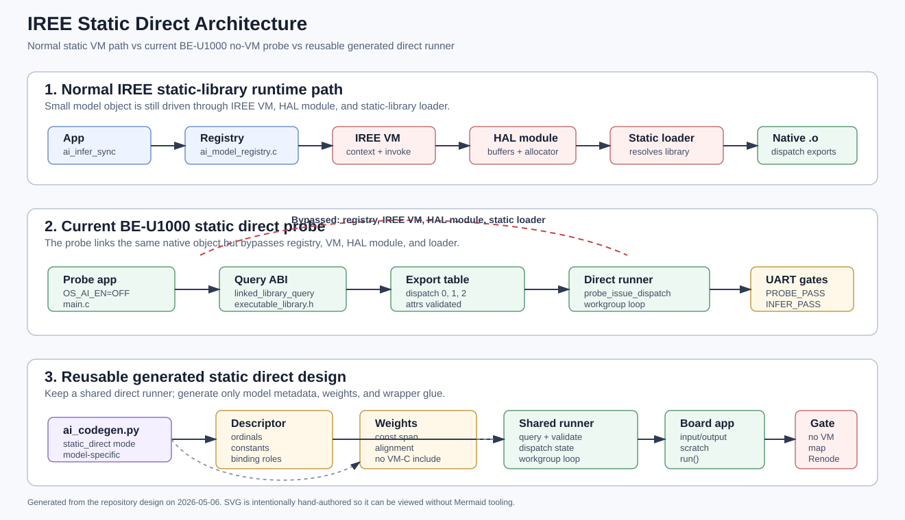
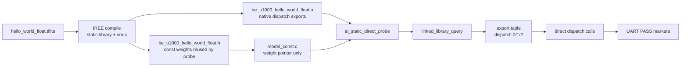
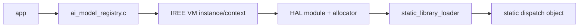
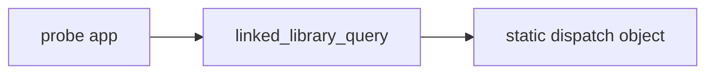
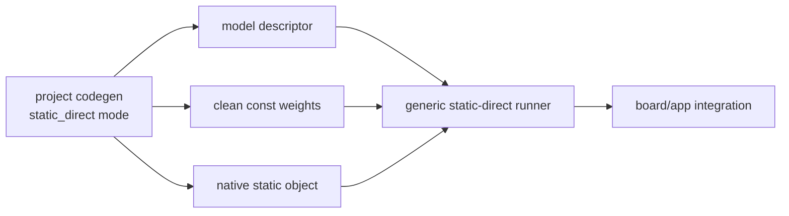

# IREE Static Direct Probe

This document records the experimental BE-U1000 path that calls an IREE
`static-library` executable directly, without the project AI registry, IREE VM,
HAL module, or static-library loader.

## Status

- App: `apps/be_u1000_ai_static_direct_probe`
- Build lane: `BE_U1000_APP=ai_static_direct_probe`
- AI runtime: `OS_AI_EN=OFF`
- C++ runtime: `RRTOS_CXX_EN=OFF`
- Memory model: `BE_U1000_MEMORY_MODEL=flash`
- Validation: `pixi run -e be-u1000 validate-ai-static-direct`
  - map gate: rejects `iree_vm_`, HAL module, and static-library loader symbols
  - Renode gate: requires `BE_U1000_STATIC_DIRECT_PROBE_PASS` and
    `BE_U1000_STATIC_DIRECT_INFER_PASS`
- Support status: experimental only

The important result is that the generated native dispatch object can run
without VM runtime symbols in the final image when the model schedule is fixed
and known ahead of time.

## Architecture

The generated architecture diagram is available as:





The normal static path is different:



The probe intentionally bypasses the middle of that stack:



## Current Measurements

The current Renode measurements are useful for relative comparison only. The
VM/C++ and VMVX numbers come from earlier BE-U1000 AI micro runs; the direct
probe number comes from `validate-ai-static-direct`.

| Lane | Final bin | Text | Invoke evidence |
| --- | ---: | ---: | --- |
| Static VM/C++ | 187576 bytes | 184524 bytes | avg 1382 us, heap invoke peak 69504 bytes |
| Static ukernel | 127012 bytes | 123940 bytes | avg 1917 us, heap invoke peak 70592 bytes |
| VMVX inline | 68316 bytes | 66880 bytes | avg 1096 us, heap invoke peak 15304 bytes |
| Static direct probe | 88016 bytes | 87932 bytes | direct dispatch sequence 180 CLINT ticks |

The direct probe is much smaller than the current static VM path, but still
larger than VMVX inline. That is expected: VMVX keeps model code compact as
bytecode plus interpreter logic, while static direct links native dispatch
functions and no VM stack.

## MNIST Port Experiment

There is also an experimental MNIST static-direct app:

- App: `apps/be_u1000_ai_static_direct_mnist_probe`
- Build lane: `BE_U1000_APP=ai_static_direct_mnist_probe`
- AI runtime: `OS_AI_EN=OFF`
- Model object: `apps/mnist_app/generated/st_mnist_28.o`
- Weight source: `apps/mnist_app/generated/st_mnist_28.h`
- Input sample: `apps/mnist_app/src/mnist_validation_samples.h`
- Validation task names:
  - `configure-ai-static-direct-mnist`
  - `build-ai-static-direct-mnist`
  - `validate-ai-static-direct-mnist-map`
  - `validate-ai-static-direct-mnist-renode`

The manual direct ABI port is straightforward for this FP32 MNIST model:

| Dispatch | Workgroups | Bindings | Purpose |
| --- | --- | --- | --- |
| 0 | `4 x 1 x 1` | input, const, scratch | `784 -> 128` dense layer |
| 1 | `1 x 1 x 1` | scratch, const, scratch | `128 -> 10` dense layer |
| 2 | `1 x 1 x 1` | scratch, output | softmax/output store |

The current BE-U1000 flash lane does not fit this FP32 MNIST image:

```text
ld.lld: error: section '.text' will not fit in region 'FLASH': overflowed by 164108 bytes
```

The failed link still writes a useful map. It shows `.text = 0x6810c`
(426252 bytes), while BE-U1000 eFlash is 256 KiB. The dominant contributor is
`st_mnist_28__const = 0x63640` (407104 bytes). The actual native dispatch code
from `st_mnist_28.o` is small; the model constants are the blocker.

The no-VM invariant still holds for the failed MNIST link map:

```bash
python3 scripts/check_no_iree_vm_symbols.py \
  --map build-be_u1000_ai_static_direct_mnist_probe/rrtos_be_u1000.map
```

This prints `NO_IREE_VM_SYMBOLS_PASS`. So the problem is not VM/HAL runtime
leakage. The problem is that full FP32 MNIST weights do not fit the current
BE-U1000 256 KiB flash policy. Running MNIST on this board needs a smaller
model, a quantized model whose generated native code still fits, or a design
that stores weights outside the internal eFlash path.

## How The Probe Runs

The current implementation is deliberately small and explicit. It proves the
minimum path first, before introducing a generator or reusable runtime layer.

## Implementation Walkthrough

The implementation has four pieces:

| Piece | File | Responsibility | Reusable? |
| --- | --- | --- | --- |
| App registration | `CMakeLists.txt` | Adds `BE_U1000_APP=ai_static_direct_probe` and keeps the lane out of `OS_AI_EN` | Yes, as a board app pattern |
| Probe target | `apps/be_u1000_ai_static_direct_probe/CMakeLists.txt` | Links RTOS, board HAL, IREE executable-library header, and the raw generated `.o` | Partly, should become generated/model-parametric |
| Dispatch runner | `apps/be_u1000_ai_static_direct_probe/main.c` | Queries exports, validates attrs, builds dispatch state, calls workgroups, checks output | Yes, this is the reusable core shape |
| Weight bridge | `apps/be_u1000_ai_static_direct_probe/model_const.c` | Reuses generated `__const` data from the VM-C header | No, replace with clean generated weights |

The target links the raw object directly:

- `apps/be_u1000_ai_micro_demo/generated/be_u1000_hello_world_float.o`

That object provides the standalone executable-library query symbol:

- `be_u1000_hello_world_float_linked_library_query(...)`

The probe calls the query symbol with a zeroed
`iree_hal_executable_environment_v0_t`, casts the returned header to
`iree_hal_executable_library_v0_t`, checks the export table, then invokes the
dispatch functions directly. The reusable call helper is
`probe_issue_dispatch()` in `apps/be_u1000_ai_static_direct_probe/main.c`.

`probe_issue_dispatch()` is the important piece. It:

1. Checks that the export ordinal and function pointer exist.
2. Checks `iree_hal_executable_dispatch_attrs_v0_t` against the expected
   constant count, binding count, and local memory pages.
3. Fills `iree_hal_executable_dispatch_state_v0_t`.
4. Iterates `workgroup_id_x/y/z`.
5. Calls `library->exports.ptrs[ordinal](environment, &dispatch_state,
   &workgroup_state)`.

The app avoids these normal IREE runtime pieces entirely:

- `ai/src/ai_model_registry.c`
- `rv_aios_ai`
- `rv_aios_models`
- `iree_vm_context_run_function`
- `iree_modules_hal`
- `iree_hal_static_library_loader`

The absence of those symbols is not just an observation. It is checked by
`scripts/check_no_iree_vm_symbols.py` through the
`validate-ai-static-direct-map` Pixi task.

The current binding schedule is hand-transcribed from the generated VM-C path:

- dispatch 0: input + weights to temporary buffer
- dispatch 1: temporary buffer + weights to temporary buffer
- dispatch 2: temporary buffer + weights to output

One ABI detail matters: `constant_count` is metadata passed in
`iree_hal_executable_dispatch_state_v0_t`; it is not itself a push constant.
The actual dispatch push constants start after that count. Passing
`{4, 64, 0, 1}` to dispatch 1/2 is wrong; the working push constants are
`{64, 0, 1, 0}`.

## Reusable Static Direct Design

The reusable design is not "one app per model". It should be:



The generic runner should own only the IREE executable-library ABI mechanics:

- query the linked executable library
- validate export attrs
- build `iree_hal_executable_dispatch_state_v0_t`
- iterate workgroups
- pass binding pointers and lengths
- expose a synchronous fixed-shape `run()` style API

Everything model-specific should move into generated metadata:

- linked library query symbol name
- expected executable name/version if needed
- dispatch sequence
- export ordinals
- push constants per dispatch
- workgroup counts per dispatch
- binding roles per dispatch
- const-weight span
- temporary buffer sizes and alignment
- input/output tensor metadata
- output check metadata for smoke tests

That split makes the design reusable across fixed-shape TinyML models while
keeping the runtime small. The board app should only allocate input, output,
scratch, and call the generated runner.

## Reuse Decision Table

| Area | Reuse as-is? | Reason |
| --- | --- | --- |
| `linked_library_query` discovery | Yes | This is the IREE static executable ABI boundary |
| `probe_issue_dispatch()` shape | Yes | It is model-independent except for expected attrs and state inputs |
| Map gate | Yes | Every no-VM lane should reject VM/HAL loader symbols |
| Renode marker gate | Yes | App-specific markers make experimental lanes automatable |
| Hand-written dispatch list | No | Must be generated from compile metadata or extracted VM-C metadata |
| Hard-coded temp/const sizes | No | Must be generated per model |
| `model_const.c` including VM-C | No | Acceptable for proof only; production should emit standalone weights |
| Output range check | Partly | Useful for smoke tests, but model-specific |
| BE-U1000 app target | Partly | Board wiring is reusable, model metadata should be target-independent |

## Generator Contract

A project-owned `static_direct` backend in `scripts/ai_codegen.py` should emit
three artifacts for each model:

1. `model_static_direct_desc.c/.h`
   - model name
   - query symbol declaration
   - dispatch descriptor array
   - tensor metadata
   - scratch/const size requirements
2. `model_static_direct_weights.c/.h`
   - const data span
   - alignment
   - no VM-C include
3. `model_static_direct_runner.c/.h`
   - generic direct-dispatch helper or calls into a shared helper
   - model-specific `run()` wrapper
   - optional smoke-test output checker

The generated descriptor should be data-first. Avoid generating a large custom
C function for every model unless the compiler later proves that it saves more
space than a compact descriptor plus shared runner.

The minimum dispatch descriptor shape is:

```c
typedef struct {
    uint32_t ordinal;
    uint16_t constant_count;
    uint8_t binding_count;
    uint8_t local_memory_pages;
    uint32_t workgroup_count_x;
    uint32_t workgroup_count_y;
    uint32_t workgroup_count_z;
    const uint32_t *constants;
    const uint8_t *binding_roles;
} ai_static_direct_dispatch_desc_t;
```

The binding roles let the shared runner map model-independent slots such as
`input0`, `output0`, `const0`, and `scratch0` to the binding table required by
each dispatch.

## Porting Checklist

For another fixed-shape model, the current manual process is:

1. Compile the model with IREE static-library output and keep the native `.o`.
2. Confirm the object exposes a `*_linked_library_query` symbol.
3. Inspect generated VM-C or compile dump to recover dispatch order, push
   constants, binding roles, and scratch sizes.
4. Link the `.o` as an external object in the app target.
5. Provide const weights without linking `rv_aios_models` or `rv_aios_ai`.
6. Call the executable-library export table directly through the shared helper.
7. Add a map gate with `scripts/check_no_iree_vm_symbols.py`.
8. Add a runtime marker gate through `validate-ai-static-direct-renode` style
   validation.
9. Compare output against a known reference before trusting size or latency
   numbers.

The first three steps are the ones that should disappear after the generator
exists. They are manual only in the current proof.

## What This Does Not Prove

This is not yet a production model ABI.

- The dispatch order is manual.
- The push constants are manual.
- The binding table is manual.
- The temporary buffer sizes are manual.
- Weight reuse currently compiles the generated VM-C header only to expose
  `__const`; link-time garbage collection removes VM code, but this is not the
  desired long-term artifact shape.
- Dynamic shapes, asynchronous execution, device queues, and generic HAL
  behavior are out of scope for this probe.

The result is valid for fixed-shape TinyML models where the compile-time
schedule can be turned into a static direct runner.

## Next Design Step

Do not start by forking upstream IREE runtime behavior. Keep the first real
integration project-owned:

1. Extend `scripts/ai_codegen.py` with a `static_direct` backend mode.
2. Generate a small model descriptor containing export ordinals, push constants,
   binding roles, weight offsets, temporary buffer sizes, and input/output
   metadata.
3. Generate a C runner that consumes that descriptor and calls the IREE
   executable-library dispatch ABI directly.
4. Stop including VM-C headers for weights; emit a clean project-owned weight
   data artifact instead.
5. Promote the current map-file gate into any future generated static-direct
   lane so no VM or HAL loader symbols can silently return.

Only after that should a local IREE compiler fork be considered. The useful
compiler-side change would be emitting direct-runner metadata from the IREE
pipeline, not changing the BE-U1000 runtime first.

## Commands

```bash
pixi run -e be-u1000 configure-ai-static-direct
pixi run -e be-u1000 build-ai-static-direct
pixi run -e be-u1000 validate-ai-static-direct
```

The validation summary is written to:

- `logs/be_u1000_ai_static_direct_probe_runtime.md`
